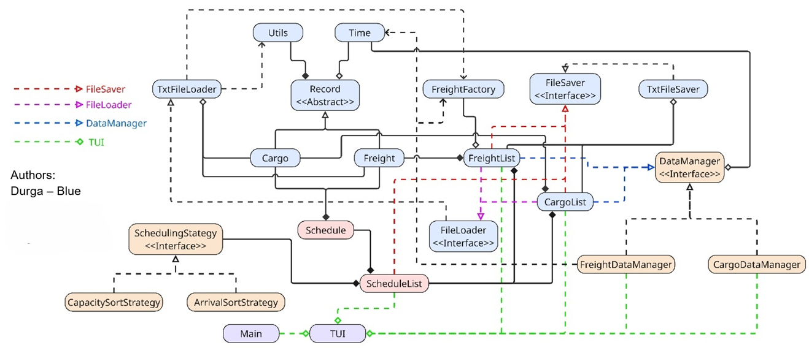
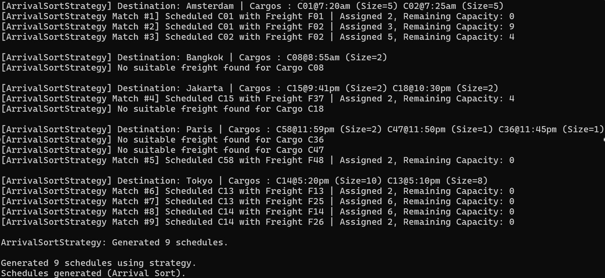
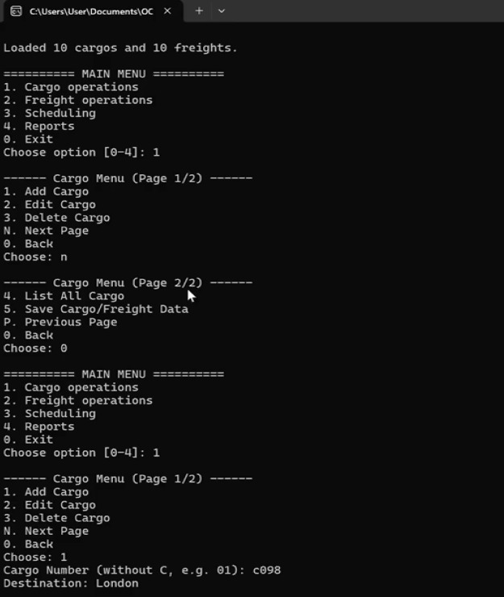

# International Freight Cargo Scheduling System — C++

A C++ object-oriented application that simulates an international cargo and freight scheduling system.

The system manages cargo and freight records, validates and stores data, supports CRUD operations through a text-based user interface, and automatically generates cargo-to-freight schedules based on different operational priorities.

This project was developed as a **group project** for an Object-Oriented Programming module.

---

## Project Overview

The application models a freight scheduling workflow in which cargos must be assigned to suitable freight vehicles based on:

- Destination
- Cargo arrival requirements
- Freight departure time
- Freight capacity
- Cargo group size
- Scheduling priority

Users can load existing cargo and freight data, modify records, generate schedules, view reports and export updated information.

Two scheduling approaches are available:

- **Arrival Priority** — prioritises cargos being assigned to freight with the closest suitable departure time.
- **Capacity Priority** — prioritises efficient use of freight capacity by minimising unused space.

---

## Main Features

- Load cargo and freight records from text files
- Validate IDs, destinations and time values
- Add, edit and delete cargo records
- Add, edit and delete freight records
- Automatically format cargo and freight IDs
- Maintain cargo and freight data in memory
- Generate schedules automatically
- Switch between multiple scheduling strategies
- Detect cargos that cannot be assigned
- Report freights that are not fully utilised
- Export updated cargo, freight and schedule information
- Navigate the application through a paginated text-based user interface

---

## System Architecture

The application was designed using a modular object-oriented architecture.

### Core Data Layer

Core entities represent cargo, freight and time-related information.

Key classes include:

- `Record` — abstract base class containing common cargo/freight information
- `Cargo` — represents an individual cargo and its group size
- `Freight` — represents a freight vehicle and its capacity
- `Time` — handles time parsing, storage and comparisons
- `Utils` — provides shared validation and string-processing utilities

### Data Storage

- `CargoList`
- `FreightList`

These classes manage the in-memory cargo and freight collections used by the rest of the system.

### File I/O

File operations are separated from the business logic through:

- `FileLoader`
- `TxtFileLoader`
- `FileSaver`
- `TxtFileSaver`

The loader reads and validates input data, while the saver exports updated system information.

### CRUD Layer

Cargo and freight modifications are handled by:

- `DataManager`
- `CargoDataManager`
- `FreightDataManager`

This separates CRUD operations from the user interface and underlying storage classes.

### Scheduling Layer

Scheduling is handled through:

- `Schedule`
- `ScheduleList`
- `SchedulingStrategy`
- `ArrivalSortStrategy`
- `CapacitySortStrategy`

The selected scheduling algorithm can be changed at runtime without modifying `ScheduleList`.

### Presentation Layer

The `TUI` class acts as the user-facing controller for:

- Menu navigation
- User input
- CRUD operations
- Scheduling selection
- Reports
- Data export

---

## UML Class Diagram

The following diagram shows the overall class structure and relationships between the major components of the system.



For a detailed and zoomable version containing the full class information:

[View Full UML Class Diagram](docs/OOP_Prj2_UML_V7.pdf)

---

## Design Patterns

### Strategy Pattern

The scheduling system uses the **Strategy Pattern** to support multiple scheduling algorithms.

`SchedulingStrategy` defines a common scheduling interface, while the individual scheduling algorithms are implemented by:

- `ArrivalSortStrategy`
- `CapacitySortStrategy`

`ScheduleList` holds the selected strategy and delegates the scheduling process to it.

This allows new scheduling methods to be introduced without rewriting the existing scheduling system.

### Factory Method

`FreightFactory` centralises freight creation.

The factory determines the appropriate capacity based on the freight type and returns a fully configured `Freight` object.

The system supports freight categories such as:

- MiniMover
- CargoCruiser
- MegaCarrier

Centralising this logic avoids repeating freight-capacity rules throughout the application.

---

## Scheduling Strategies

### Arrival Priority

The arrival-based strategy focuses on assigning cargos to freights with the closest suitable departure time.

For each cargo, the system:

1. Identifies freights with a compatible destination.
2. Checks the required timing constraints.
3. Calculates the time difference between cargo arrival and freight departure.
4. Selects the suitable freight with the closest timing.
5. Updates the freight's remaining capacity.

This strategy is intended for situations where timely delivery is the primary consideration.

### Capacity Priority

The capacity-based strategy focuses on reducing unused freight capacity.

For each cargo, the system:

1. Identifies suitable freights based on destination and timing.
2. Checks whether the cargo fits within the remaining capacity.
3. Selects the freight that will have the smallest remaining capacity after assignment.
4. Updates the temporary available capacity.

This encourages better freight utilisation and consolidation.

---

## Scheduling Output

The application automatically groups cargos by destination and generates cargo-to-freight assignments based on the selected strategy.



The system also identifies cases where no suitable freight is available instead of silently creating an invalid assignment.

---

## Text-Based User Interface

The system includes a text-based interface for interacting with the different application modules.



The interface provides access to:

- Cargo operations
- Freight operations
- Scheduling
- Reports
- Data export

The cargo, freight and report menus use pagination to keep the interface organised as the number of available functions increases.

---

## Object-Oriented Design

The project applies the main principles of object-oriented programming.

### Abstraction

Interfaces and abstract classes hide implementation details from higher-level components.

Examples include:

- `Record`
- `FileLoader`
- `FileSaver`
- `DataManager`
- `SchedulingStrategy`

### Encapsulation

Classes maintain their own internal state and expose controlled methods for accessing or modifying data.

For example, `CargoList` and `FreightList` encapsulate their internal collections instead of allowing direct modification.

### Inheritance

Inheritance is used throughout the architecture, including:

- `Cargo` and `Freight` deriving from `Record`
- `ArrivalSortStrategy` and `CapacitySortStrategy` implementing `SchedulingStrategy`
- `CargoDataManager` and `FreightDataManager` implementing `DataManager`

### Polymorphism

The system uses runtime polymorphism to allow components to interact through common interfaces.

For example, `ScheduleList` can execute a scheduling strategy through the `SchedulingStrategy` interface without needing to know which concrete strategy is currently selected.

---

## SOLID Principles

The architecture was designed around the SOLID principles.

- **Single Responsibility Principle** — classes focus on individual responsibilities such as storage, scheduling, CRUD or file I/O.
- **Open/Closed Principle** — new scheduling strategies and file formats can be added without rewriting existing components.
- **Liskov Substitution Principle** — derived implementations can be used through their base interfaces.
- **Interface Segregation Principle** — functionality is separated into focused interfaces such as `FileLoader`, `FileSaver` and `DataManager`.
- **Dependency Inversion Principle** — higher-level components depend on abstractions such as `SchedulingStrategy` and `DataManager` rather than tightly coupling themselves to concrete implementations.

---

## My Contribution

This was a group project. My primary contribution was the **core data and file I/O layer** of the application.

I implemented and worked on:

- `Record`
- `Cargo`
- `Freight`
- `Time`
- `Utils`
- `CargoList`
- `FreightList`
- `FileLoader`
- `TxtFileLoader`
- `FileSaver`
- `TxtFileSaver`
- `FreightFactory`

My work included:

- Designing the core entity structure
- Implementing shared validation logic
- Handling time parsing and comparisons
- Loading cargo and freight records from text files
- Validating input before object creation
- Managing in-memory cargo and freight collections
- Exporting updated data
- Centralising freight object creation and capacity assignment

These components form the data foundation used by the scheduling, CRUD and user-interface layers.

---

## Technologies and Concepts

- C++
- Object-Oriented Programming
- Visual Studio
- File I/O
- Data Validation
- Inheritance
- Polymorphism
- Abstraction
- Encapsulation
- SOLID Principles
- Strategy Pattern
- Factory Method
- CRUD Operations
- UML Class Modelling
- Algorithm Design
- Text-Based User Interfaces

---

## Repository Structure

```text
cargo-freight-scheduling-system-cpp/
│
├── data/
│   ├── cargo.txt
│   └── freight.txt
│
├── images/
│   ├── uml-diagram.png
│   ├── scheduling-output.png
│   └── tui-menu.png
│
├── docs/
│   └── OOP_Prj2_UML_V7.pdf
│
├── *.cpp
├── *.h
├── *.sln
├── README.md
└── .gitignore
```

The repository excludes generated Visual Studio build files such as `.vs`, `x64`, object files and executable output.

---

## Running the Project

1. Clone or download the repository.
2. Open the included `.sln` file in Visual Studio.
3. Build the solution.
4. Run the application.
5. Provide the required data folder when prompted.
6. Use the text-based menu to manage cargo/freight records or generate schedules.

The `data` folder contains the text files used by the program for cargo and freight information.

---

## Academic Context

This project was completed as part of an **Object-Oriented Programming** module in the Bachelor of Engineering with Honours in Electronics and Data Engineering programme.

The project focused on applying object-oriented design, SOLID principles and software design patterns to a realistic cargo and freight scheduling problem.
